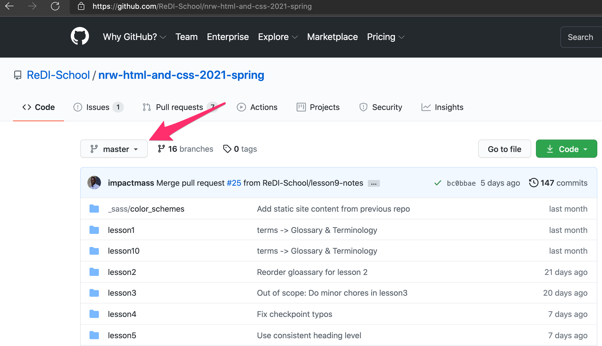
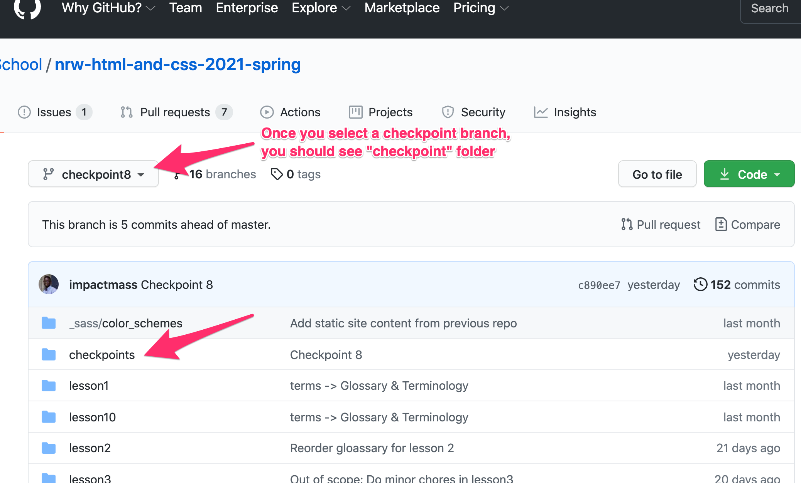
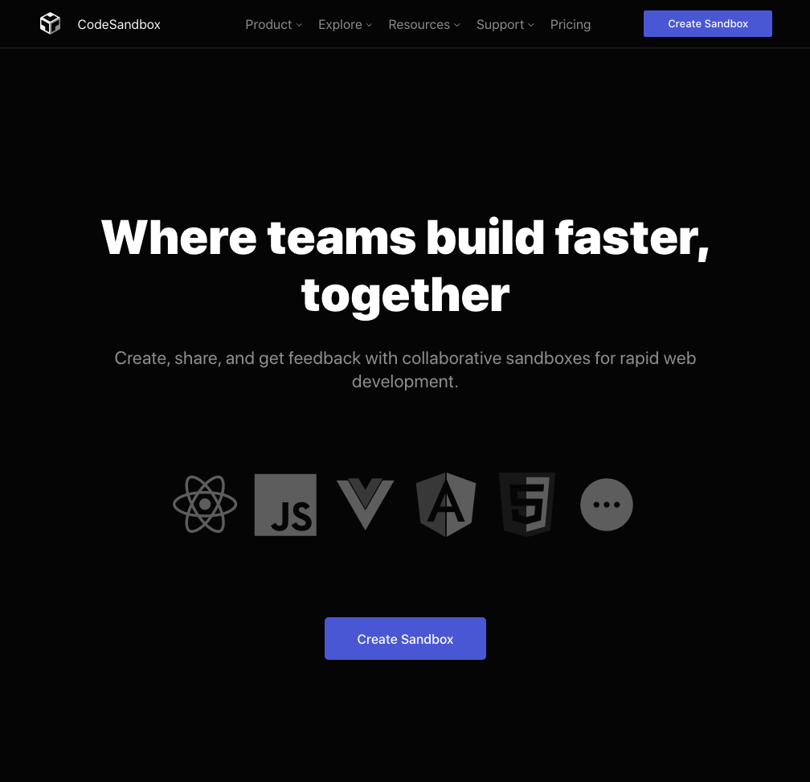
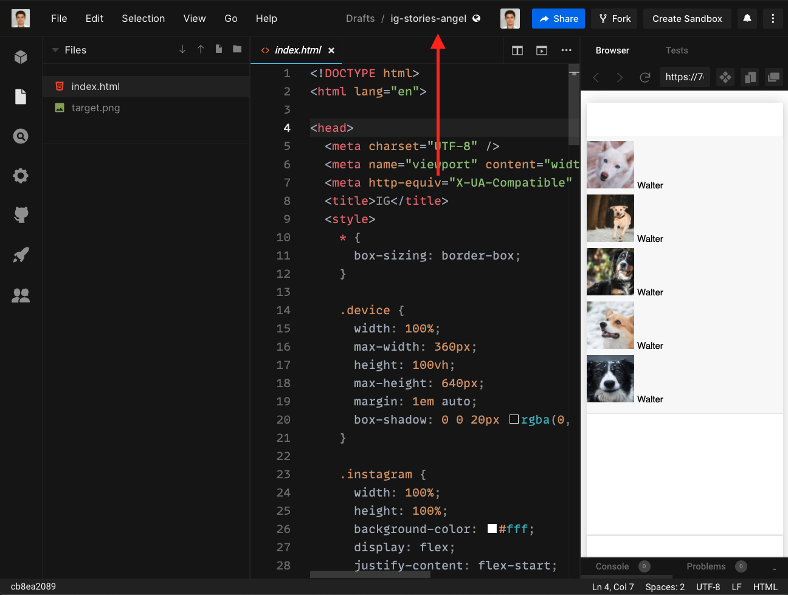

# Welcome & Organization

## Class Agenda

1. Welcome & Student Introduction
2. Organizational
3. Project Website
4. Working environment

## 1. Welcome & Student Introduction

This is the first lesson in our HTML & CSS course. We would like to use this opportunity to build a stronger relationship between teachers and students, and also among students themselves. Students could each present themselves for around 3 minutes. Good questions to get to know people are:

- Could you shortly describe yourself?
- How is your name pronounced? How would you like to be called?
- What are your interests in your free time?
- What inspires you about tech? Did you have any technical background?
- What do you expect from this course?

ETA: ~50min

## 2. Organizational

In this section we would like to cover the organizational topics around our course. This includes:

- Presentation of the website we have - <https://redi-school.github.io/nrw-html-and-css/lesson1//>
- The framework of lesson notes
  - Class Agenda
  - Content Sections
  - Exercise Description
  - Glossary & Terminology
  - Homework
  - Resources
- The use cases for lesson notes: studying in advance or looking back at past material

Apart from that we would like to describe the process of feedback and homework checks.

- We usually do not check homework but we encourage people to do it.
- Once some homework task is done students can share and compare with each other via the Classroom channel which is highly advised. You learn the most through sharing!
- If students would like they can also consult with a teacher via the Classroom channel. We would try responding in timely manner.

ETA: 10min

## 3. Project Website

The practical part of this course is covered by a project which is built throughout the whole semester in parallel to the lessons. The project is about building an own personal website. The website is a personal portfolio (CV) website built with HTML & CSS only.

Example CV Websites:

- <https://www.sesanosanyinbi.com/>
- <https://ethanmarcotte.com/>
- <https://laurieontech.com/>
- <https://rachelandrew.co.uk/>
- Example of the checkpoint website
- An example [student website](https://julietchuks.github.io/Portfolio/) presented during the [demo day](https://youtu.be/upP5NuMLCGU?t=146) in 2020 Spring semester

ETA: 30min

## _What are checkpoints?_

To achieve building the final website we would need to go through a series of small steps. This project is the way to show student progress on topics taught in class. To help students making progress on their website the teacher team has created their own example CV website. This website is built step-by-step with real code examples after every lecture. The step is called a checkpoint.

> A checkpoint is one stage of work that use topics students are taught in class to achieve a small part of the project. It contains real code and is useful for everyone to look at and follow.

## _How to find a checkpoint?_

Almost every lesson contains a corresponding checkpoint related to it. For example, lesson 5 has checkpoint 5 with code related to it. Keep in mind that some lessons might not have a corresponding checkpoint. For example, if lesson 6 does not have a checkpoint then the corresponding number is simply skipped. Students need to jump from checkpoint 5 to 7 because the checkpoint order number must match the lesson number.

### 1. By using a direct link

You can find the code for each checkpoint inside our github repository using a direct link to it. For example, if you would like to see the code for checkpoint 12 you can go to <https://github.com/ReDI-School/nrw-html-and-css/tree/checkpoint12/checkpoint>. If you would like to visit checkpoint 17 instead then you should simply change the checkpoint number in the link above and use the following link instead - <https://github.com/ReDI-School/nrw-html-and-css/tree/checkpoint17/checkpoint>

### 2. By manually navigating to the page

- Visit the course's [GitHub page](https://github.com/ReDI-School/nrw-html-and-css). You should see something similar to the screenshot below.
- Click on the Branch dropdown (shown in the screenshot)

- In the dropdown, select a checkpoint branch that matches the lesson you want to see. For example, if you want to see the Checkpoint for Lesson 8, select "checkpoint8" branch. Note that not all Lessons have a corresponding checkpoint branch.

- Once you select a checkpoint branch, you will see a folder named "checkpoint". This folder contains the checkpoint files you are looking for.

## _How to compare one checkpoint with a previous one?_

Comparing checkpoints is very useful when checking what things have been added, removed or changed. The code difference will ease your transition between different stages of work.

The easiest way to compare branches with each other is to use the following link and adjust the checkpoint numbers accordingly. For example, if you would like to compare checkpoint 17 with checkpoint 16 you can use. This link opens a code diff in GitHub. There is no need to do any further action than simply looking at the code difference.

- <https://github.com/ReDI-School/nrw-html-and-css/compare/checkpoint16...checkpoint17>

The page shown by the url given above can also be reached by manually navigating to it via the GitHub UI. Nevertheless, this option is more cumbersome so we suggest using the direct link instead. If you have any difficulties consider consulting a teacher.

## 4. Working environment

This section describes the steps to set up an environment. If there is no time to finish this in class then students are advised to set up their environment as a homework.

In this project we are going to use [Code Sandbox](https://codesandbox.io) for writing code. It gives us the opportunity to share code with each other.

### _Follow these steps in order to set up your environment:_

1. Open your browser (preferably Google Chrome) and go to https://codesandbox.io/.
2. Sign in Code Sandbox so that you keep your work saved for a long time.
3. On the top right corner there should be a blue button called `Create Sandbox`. Please click on it.

4. A pop-up window would appear. Please click on `Import Project`.
5. We need to import from GitHub. Therefore, please copy the following link <https://github.com/ReDI-School/nrw-html-and-css/tree/checkpoint1/checkpoint> and paste it into the field called `GitHub Repository URL`

6. Finally click on `Import and Fork`.
7. It is a good idea to edit the name of the new codesandbox by adding your name in it. This way, the teachers can identify your work more easily.

8. Good Luck and Have Fun !

---

# Glossary & Terminology

- `Checkpoint` - A checkpoint is one stage of work that use topics students are taught in class to achieve a small part of the project. It contains real code and is useful for everyone to look at and follow. Read more about it in the
  [3. Project CV Section](#what-are-checkpoints)

# Homework

1. Make yourself familiar with CodeSandbox in order to be able to share code with teachers.
2. (Optionally) Set up a local development environment with Visual Studio Code
   1. Download VS Code
   2. Set up [Live Server Extension](https://marketplace.visualstudio.com/items?itemName=ritwickdey.LiveServer)

# Resources

The following articles are good starting point for reading about HTML and CSS. Please keep in mind that some of the articles might go too much into details and cover topics that you would learn in upcoming sessions:

- <https://codesandbox.io>
- <https://code.visualstudio.com/download>
