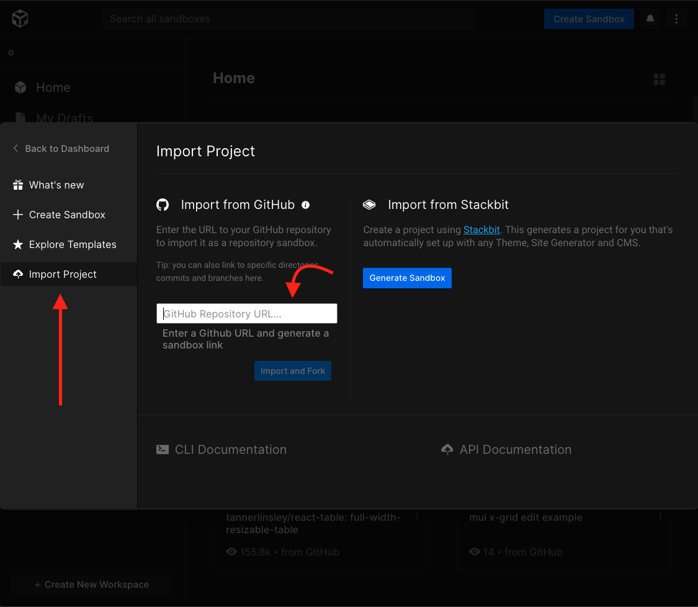

## Prerequisite

Every student who enters the class should bring their implementation of their own portfolio project. In other words, every student should bring their code and show it to teachers, ideally in CodeSandbox or locally in their VS Code environment.

## Agenda

1. Reach [Checkpoint 17](https://github.com/ReDI-School/nrw-html-and-css/tree/checkpoint18/checkpoint)
1. Do extra exercises

## 1. Reach Checkpoint 17

The goal of this class is to make sure that every student has reached checkpoint 17 in their own portfolio projects. Teachers would help students if they have not reached the checkpoint yet.

## 2. Quiz

During the class, there will be a quiz to review CSS Cascade, Specificity & Inheritance. The questions for the quiz are in [quiz.md](./quiz/quiz.md) (SPOILER ALERT: Please do not open this link before the quiz is over). A Slido link will be shared in the class to facilitate the quiz.

## 3. Extra exercises

If a student has reached checkpoint 17 then they can start doing extra exercises from the following list. Students can choose whatever exercise they want because there is no order. The list is solely categorized based on difficulty.

### Easy

- **Overflow:** Look at the template and the target result and try to apply the corresponding CSS in order to reach the target More instructions are found inside the exercise. [Resource - Copy this link if you want this exercise](https://github.com/ReDI-School/nrw-html-and-css/tree/master/lesson18/exercises/overflow/template)

### Medium

- **Positioning:** Look at the template and the target result and try to apply the corresponding HTML and CSS in order to reach the target More instructions are found inside the exercise. [Resource - Copy this link if you want this exercise](https://github.com/ReDI-School/nrw-html-and-css/tree/master/lesson18/exercises/position-redi-logo/template)

## Homework

- Try doing all exercises which you haven't managed to finish in class.

## How to start an exercise in codesandbox ?

1. Open your browser and go to https://codesandbox.io/.
2. (Optional) step - you can sign in codesandbox so that you keep your work saved for a long time.
3. On the top right corner there should be a blue button called `Create Sandbox`. Please click on it.
4. A pop-up window would appear. Please click on `Import Project`.
5. After you have chosen an exercise from the given ones above, you have to copy the `Resource` link for that chosen exercise and paste it into the field called `GitHub Repository URL`
6. Finally click on `Import and Fork`.
7. It is a good idea to edit the name of the new codesandbox by adding the name of the exercise and your name. This way, the teachers can identify your work more easily.
8. Good Luck and Have Fun !

- Step 3
  

- Steps 4, 5 and 6
  

- Steps 7 and 8
  
