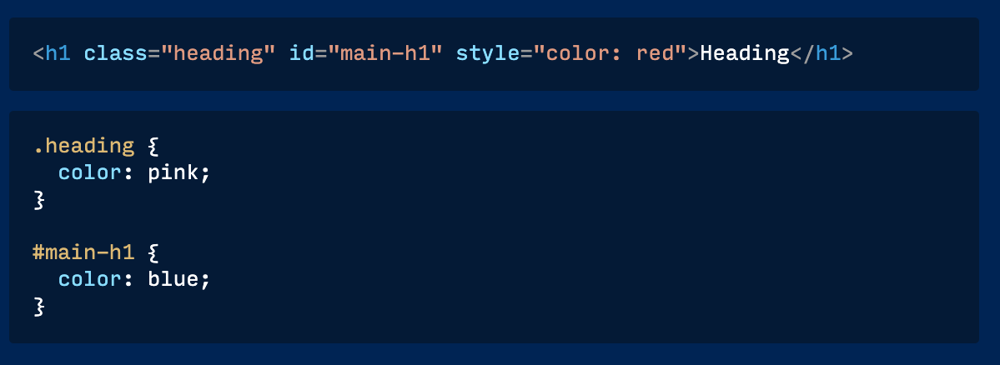
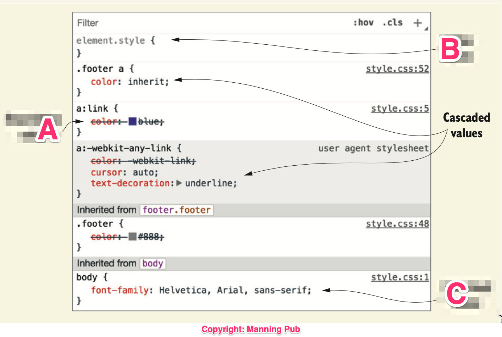
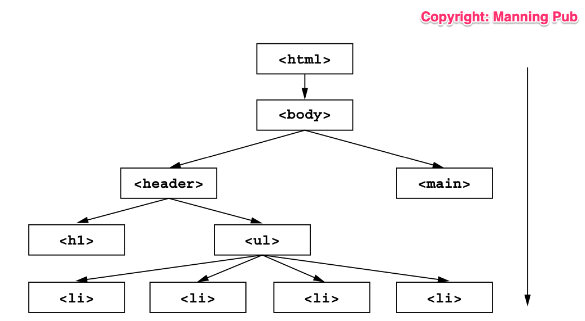
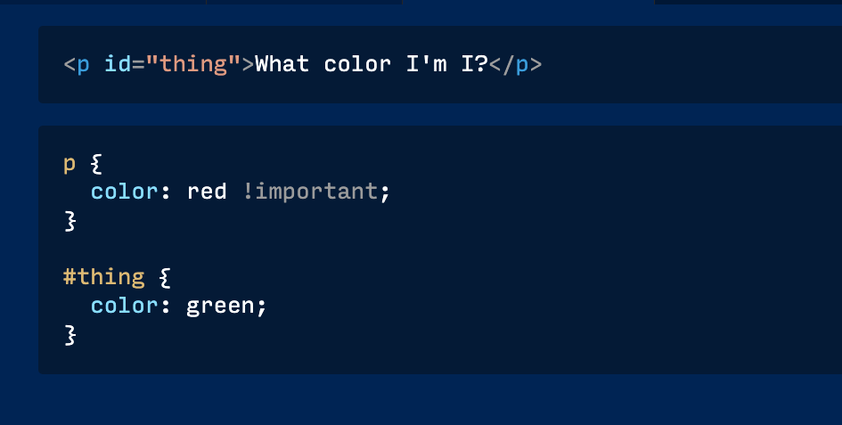
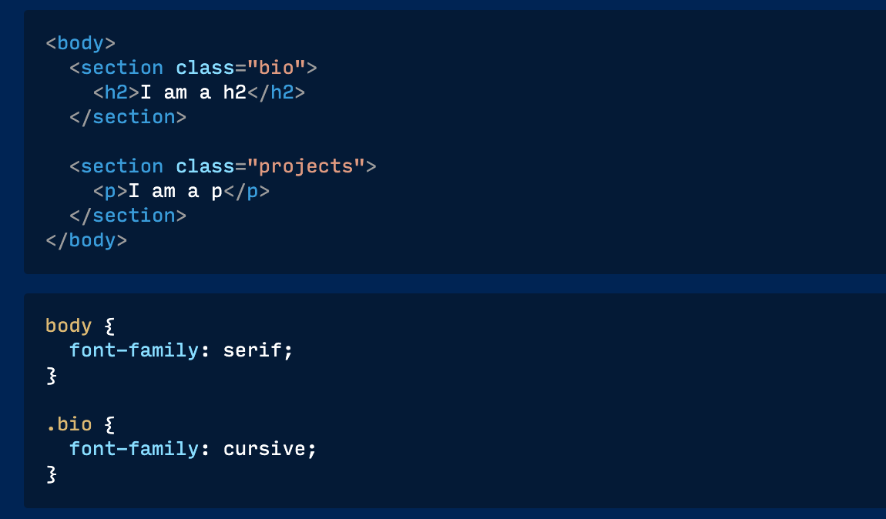

# Quiz

## Question 1

**The "C" in CSS means?**
- Center
- Curly
- Cascading (Answer)
- Computer

## Question 2

**For this question, take a look at the image below. Which background-color will the browser apply on the div?**

- #ccc
- lightblue (Answer)
- red
- orange

Explanation: Note that the 3 style blocks shown are all using class selectors, which means they all have the same specificity.
With such situation, only the last rule in the source code will be applied.

## Question 3

**In the image below, which color will the browser apply on the div?**

- none
- pink
- red (Answer)
- blue

Explanation: Styles written inline within the HTML tag will alway override any other similar style defined in a stylesheet.

## Use this image to answer questions 4, 5 and 6.

## Question 4

**Which of the options below describes "A" in the image?**
- Cascaded Value
- Overridden value (Answer)
- Inline style
- Inherited value

Explanation: The `color: blue` is overridden by `color: inherit`.
The Chrome dev tools displays overridden styles with strike-through (i.e crossed out).

## Question 5

**Which of the options below describes "B" in the image?**

- Cascaded Value
- Overridden value
- Inline style (Answer)
- Inherited value

Explanation: The Chrome dev tools displays inline styles in a `element.style` block.

## Question 6

**Which of the options below describes "C" in the image shown?**

- Cascaded Value
- Overridden value
- Inline style
- Inherited value (Answer)

Explanation: The Chrome dev tools includes the parent element from which particular styles are inherited.

## Question 7

**Which CSS terminology describes what is shown in the image below?**

- Overflow
- Styling
- Inheritance (Answer)
- Top-Down

Explanation: The picture shows an HTML tree structure.
In the CSS, some styles are passed down from parents to descendants in the tree (Inheritance).

## Question 8

**Which color is applied to the p tag in the image below?**

- red (Answer)
- green
- red and green
- none

Explanation: `!important` overrides the ID selector styles.

## Question 9

**Which font-family is applied to the p tag in the image below?**

- serif (Answer)
- cursive
- serif and cursive
- none

Explanation: The `p` element inherits the serif font-family from `section.projects` which inherits it from the `body`. Note that the font-family defined on `section.bio` does not affect `section.projects`. Inheritance flows downwards, and not to sibling elements.

## Question 10

**Which of the following is good CSS advice?**

- Always use !important everywhere since it always win when there is a conflict. And it is easy to remember.
- Always use the least number of selectors required to style an element the way you want. (Answer)
- Always use IDs (#) on all elements because it is the selector with highest specificity.
- Do not allow inherited values, they will make your CSS life difficult.

Explanation:
- Avoid `!important`. Only use it when there is no other option left.
- Don't just apply IDs to every element. IDs have the highest selector specificity. Use the least specific selector that achieves your styling.
- Inherited styles/values are good. Using it means that you do not have to repeat your styles. If you apply `color` on an element, it will pass it down to it's child elements, and you will not need to apply the same color to the child elements.
